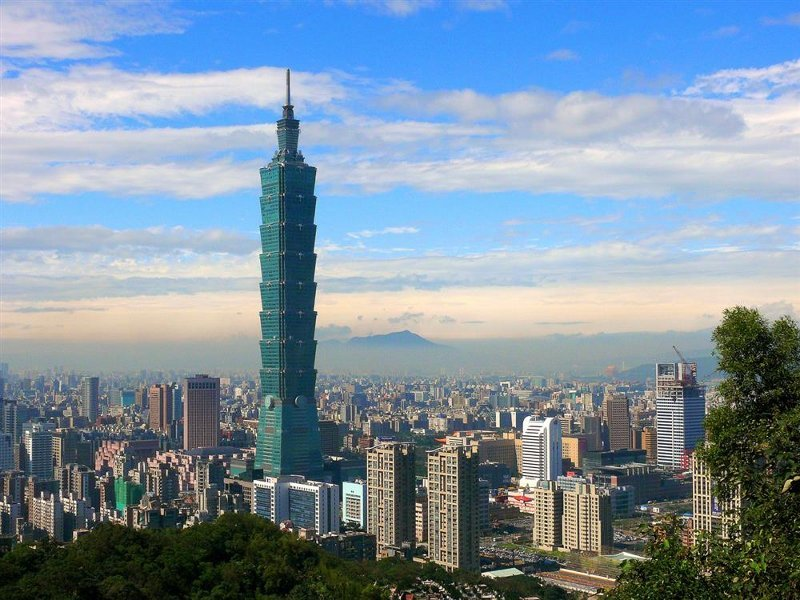

# NeuralArtTF
Implementation of A Neural Algorithm of Artistic Style by Tensorflow. 
Requirements:

1)Tesnorflow 
2)VGG 19 model 

Example:

Content 
Taipei101.jpg 

Style: 
StarryNight.jpg 

Solution: 
Taipei101_StarryNight.jpg 

